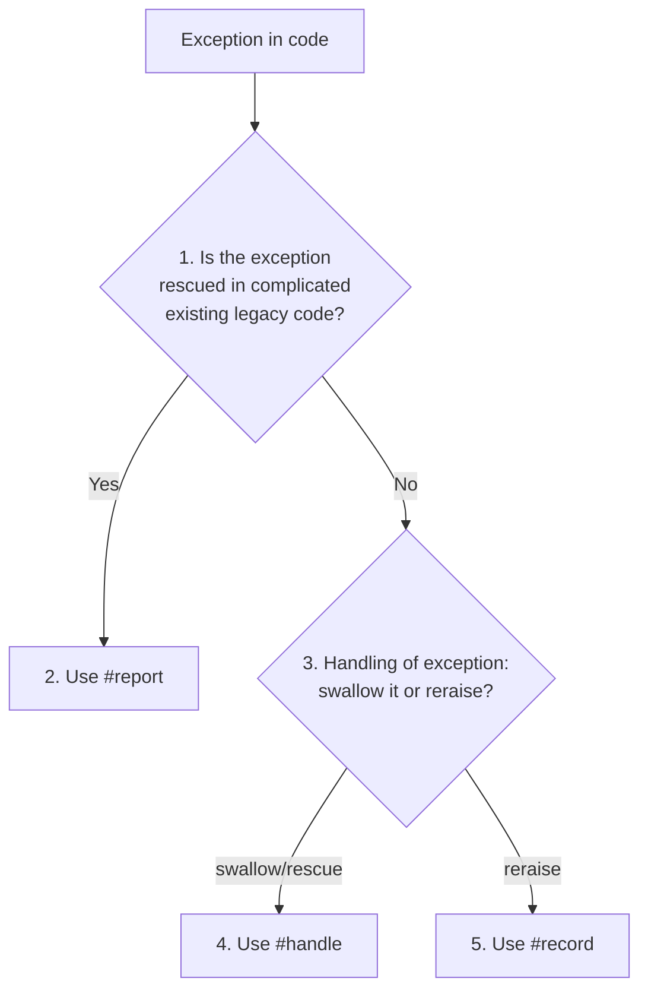

When rescuing an exception we want to:

* Send to the logs
* Report to Sentry
* Send structured data along to help debugging

By default, many Rails teams use a pattern:

```ruby
class RequestQuote
  def call(id)
    http_client.get("/api/v1/quotes/#{id}.json")
  rescue HTTPFailure => error
    logger.error("Something went wrong")
    Sentry.capture_exception(error)
  end

  def http_client
    Faraday.new { |f| f.response :raise_error }
  end
end
```

This has many disadvantages:

1. **Cognitively heavy** - every time we rescue, we need to decide what to do
1. **Opaque intent** - no abstractions mean we're not communicating effectively with humans
1. **Tightly coupled, duplicate code** - when we change how we log, these changes will ripple out
1. **Missing structured data in logs** - we can build context into the error and send this to the logs

## Solution - `Rails.error`

* Introduced in Rails 7
* Implemented by [`ActiveSupport::ErrorReporter`](https://api.rubyonrails.org/classes/ActiveSupport/ErrorReporter.html)
* Has three different methods - [`#handle`](https://api.rubyonrails.org/classes/ActiveSupport/ErrorReporter.html#method-i-handle), [`#record`](https://api.rubyonrails.org/classes/ActiveSupport/ErrorReporter.html#method-i-record) and [`#report`](https://api.rubyonrails.org/classes/ActiveSupport/ErrorReporter.html#method-i-report)
* Allows a `fallback` to be specified
* Allows [setting context](https://api.rubyonrails.org/classes/ActiveSupport/ErrorReporter.html#method-i-set_context)
* Operates on a [pub-sub](https://api.rubyonrails.org/classes/ActiveSupport/ErrorReporter.html#method-i-subscribe) architecture

## Usage

Example above becomes:

```ruby
class RequestQuotes
  def call(id)
    Rails.error.handle(HTTPFailure) do
      http_client.get("/api/v1/quotes/#{id}.json")
    end
  end
  # ... snip ...
end
```

Create subscribers:

```ruby
# config/initializers/semantic_logger.rb
Rails.error.subscribe(ErrorHandler::SemanticLogger.new)

# config/initializers/sentry.rb
Rails.error.subscribe(Sentry::Rails::ErrorSubscriber.new)
```

And it just works.

## Which method do I use?

Three options:

* `#handle` - most common. Rescues the exception and swallows it. `warning` severity.
* `#record` - rescues, but then reraises exception. `error` severity.
* `#report` - use with legacy code with complex error handling.



## Examples

Given we have a subscriber:

```ruby
class Subscriber
  def report(error, handled:, severity:, context:)
    logger.log(level: severity, error: error, handled: handled, context: context) # pseudocode
  end
end

Rails.error.subscribe(Subscriber.new)
```

### `#handle` example

Use `#handle` when you need to swallow the exception.

```ruby
class RequestQuotes
  def call(id)
    Rails.error.handle(HTTPFailure, fallback: -> { 'invalid' }) do
      http_client.get("/api/v1/quotes/#{id}.json")
    end
  end
end

RequestQuotes.new.call("invalid-id") # => 'invalid'
# log entry: { level: :warning, error: 'HTTPFailure', handled: true, context: {}}
```

### `#record` example
  
Use `#record` when you need to reraise the exception.

```ruby
class RequestQuotes
  def call(id)
    Rails.error.record(HTTPFailure) do             # no fallback option
      http_client.get("/api/v1/quotes/#{id}.json")
    end
  end
end

RequestQuotes.new.call("invalid-id") # => HTTPFailure (invalid-id cannot be found)
# log entry: { level: :error, error: 'HTTPFailure', handled: false, context: {}}
```

### `#report` example
  
Use `#report` when you need to send the error along without any rescuing behavior.

Some use cases:

* when the `rescue` block [is very complicated](https://github.com/BiggerPockets/biggerpockets/blob/f3422ab30d481ad9f5945f8310e6d20b43c7020f/app/controllers/application_controller.rb#L122-L157)
* need to rescue multiple error classes (currently `#handle` and `#record` don't support this)

```ruby
class RequestQuotes
  def call(id)
    http_client.get("/api/v1/quotes/#{id}.json")
  rescue HTTPFailure => error
    Rails.error.report(error, handled: true) # No block syntax
    'invalid'
  end
end

RequestQuotes.new.call("invalid-id") # => 'invalid'
# log entry: { level: :warning, error: 'HTTPFailure', handled: true, context: {}}
```

## Bad

```ruby
def call(relation)
  search_location = US::City.find_by_city_and_state_id!(location.city, location.state)
  # ... snip ...
rescue US::City::NotFound => exception
  logger.error("Something went wrong: #{exception}")
  Sentry.capture_exception(exception)
  relation.none
end
```

## Good

```ruby
def call(relation)
  Rails.error.handle(US::City::NotFound, fallback: -> { relation.none }) do
    search_location = US::City.find_by_city_and_state_id!(location.city, location.state)
    # ... snip ...
  end
end
```

```ruby
# Once, in an initializer
Rails.error.subscribe(ErrorHandler::SemanticLogger.new)
```
