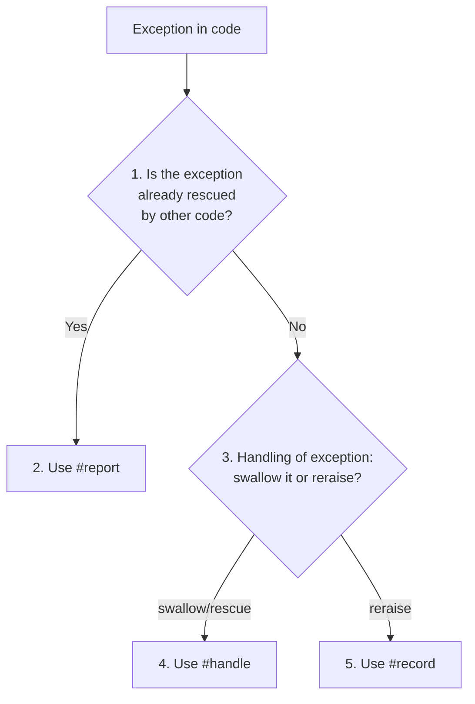

When rescuing an exception we want to:

* Send to the logs
* Report to Sentry
* Send structured data along to help debugging

By default, many Rails teams use a pattern:

```ruby
class RequestQuote
  def call(id)
    http_client.get("/api/v1/quotes/#{id}.json")
  rescue HTTPFailure => error
    logger.error("Something went wrong")
    Sentry.capture_exception(error)
  end

  def http_client
    Faraday.new { |f| f.response :raise_error }
  end
end
```

This has many disadvantages:

1. **Messy** There are three lines of noise to wade through.
2. **Cognitively heavy** Should we log an error? Or just a warning? Should we send to Sentry or not? Often this overhead means developers fall into sloppy practices, don't think through error handling and it's done inconsistently or just plain wrong.
3. **Opaque intent** Because there are no abstractions around error handling, we're not communicating effectively to humans.
4. **Tightly coupled** If we change the way we log or send to Sentry, these changes will ripple out through the codebase.
5. **Duplicate code** We have 36 instances of `Rails.logger.error` throughout our codebase and another 33 of `Sentry.capture*`. Want to make a change across all these instances? Good luck.
6. **Missing structured data in logs** The point of structured data in logs is we can search, query, group on it. Currently, many of the logging statements are sending a message and no payload. Examples of payload that we should have alongside errors in the logs - ID of object that was missing, or user who executed the code. City and state of a location that's missing. This would make debugging potentially a LOT simpler.

## Solution - `Rails.error`

* Introduced in Rails 7
* Implemented by [`ActiveSupport::ErrorReporter`](https://api.rubyonrails.org/classes/ActiveSupport/ErrorReporter.html)
* Allows for passing in structured context
* Has three different methods, each with different use cases - [`#handle`](https://api.rubyonrails.org/classes/ActiveSupport/ErrorReporter.html#method-i-handle), [`#record`](https://api.rubyonrails.org/classes/ActiveSupport/ErrorReporter.html#method-i-record) and [`#report`](https://api.rubyonrails.org/classes/ActiveSupport/ErrorReporter.html#method-i-report)
* Allows a `fallback` to be specified when you want to return an object after rescuing
* Allows [setting context](https://api.rubyonrails.org/classes/ActiveSupport/ErrorReporter.html#method-i-set_context) at a higher level that will be included in the error
* Operates on a [pub-sub](https://api.rubyonrails.org/classes/ActiveSupport/ErrorReporter.html#method-i-subscribe) architecture to decouple the rescue site from where we send the error

## Usage

Taking the example above, this would become:

```ruby
class RequestQuotes
  def call(id)
    Rails.error.handle(HTTPFailure) do
      http_client.get("/api/v1/quotes/#{id}.json")
    end
  end
  # ... snip ...
end
```

Then we set up subscribers for the logs and for Sentry:

```ruby
# config/initializers/semantic_logger.rb
Rails.error.subscribe(ErrorHandler::SemanticLogger.new)

# config/initializers/sentry.rb
# Use https://github.com/getsentry/sentry-ruby/blob/master/sentry-rails/lib/sentry/rails/error_subscriber.rb to send to Sentry
Rails.error.subscribe(Sentry::Rails::ErrorSubscriber.new)
```

## Which method do I use?

Three options:

* `#handle` - most common. Rescues the exception and swallows it. `warning` severity.
* `#record` - rescues, but then reraises exception. `error` severity.
* `#report` - use with legacy code that already has complex error handling.



## Examples

Assuming we have the pseudocode:

```ruby
class Subscriber
  def report(error, handled:, severity:, context:)
    logger.log(level: severity, error: error, handled: handled, context: context) # pseudocode
  end
end

Rails.error.subscribe(Subscriber.new)
```

### `#handle` example

```ruby
class RequestQuotes
  def call(id)
    Rails.error.handle(HTTPFailure, fallback: -> { 'invalid' }) do
      http_client.get("/api/v1/quotes/#{id}.json")
    end
  end
end

RequestQuotes.new.call("invalid-id") # => 'invalid'
# log entry: { level: :warning, error: 'HTTPFailure', handled: true, context: {}}
```

Use `#handle` when you need to swallow the exception.

### `#record` example
  
```ruby
class RequestQuotes
  def call(id)
    Rails.error.record(HTTPFailure) do             # no fallback option
      http_client.get("/api/v1/quotes/#{id}.json")
    end
  end
end

RequestQuotes.new.call("invalid-id") # => HTTPFailure (invalid-id cannot be found)
# log entry: { level: :error, error: 'HTTPFailure', handled: false, context: {}}
```

Use `#record` when you need to reraise the exception.

### `#report` example
  
```ruby
class RequestQuotes
  def call(id)
    http_client.get("/api/v1/quotes/#{id}.json")
  rescue HTTPFailure => error
    Rails.error.report(HTTPFailure, handled: true) # No block syntax
    'invalid'
  end
end

RequestQuotes.new.call("invalid-id") # => 'invalid'
# log entry: { level: :warning, error: 'HTTPFailure', handled: true, context: {}}
```

Use `#report` when you need to send the error along without any rescuing behavior.


## Bad

```ruby
def call(relation)
  search_location = US::City.find_by_city_and_state_id!(location.city, location.state)
  # ... snip ...
rescue US::City::NotFound => exception
  logger.error("Something went wrong: #{exception}")
  Sentry.capture_exception(exception)
  relation.none
end
```

## Good


```ruby
def call(relation)
  Rails.error.handle(
    US::City::NotFound,            # Currently this only accepts one error class
    fallback: -> { relation.none } # Return this value when the code fails. Pass in any object that responds to #call.
  ) do
    search_location = US::City.find_by_city_and_state_id!(location.city, location.state)
    # ... snip ...
  end
end
```

```ruby
# Once, in an initializer
Rails.error.subscribe(ErrorHandler::SemanticLogger.new)
```